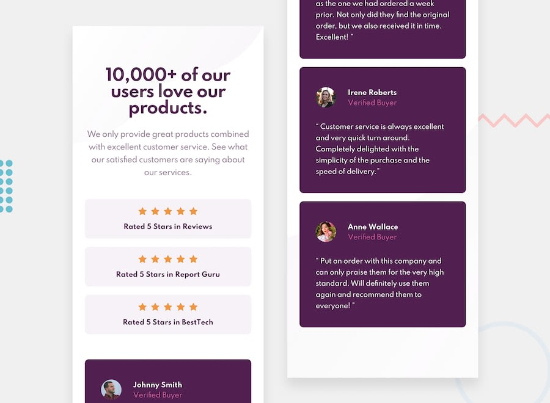

# Frontend Mentor - Social proof section solution

This is a solution to the [Social proof section challenge on Frontend Mentor](https://www.frontendmentor.io/challenges/social-proof-section-6e0qTv_bA). Frontend Mentor challenges help you improve your coding skills by building realistic projects. 

## Table of contents

- [Overview](#overview)
  - [The challenge](#the-challenge)
  - [Screenshot](#screenshot)
  - [Links](#links)
- [My process](#my-process)
  - [Built with](#built-with)
  - [What I learned](#what-i-learned)
  - [Continued development](#continued-development)
  - [Useful resources](#useful-resources)
- [Author](#author)
- [Acknowledgments](#acknowledgments)

## Overview

### The challenge

Users should be able to:

- View the optimal layout for the section depending on their device's screen size

### Screenshot

### Links

- Solution URL: [Repo](https://github.com/sedaryildirim/social-proof)
- Live Site URL: [Live Site](https://sedaryildirim.github.io/social-proof/)

## My process

### Built with

- HTML5
- CSS custom properties
- Flexbox
- CSS Grid
- Mobile-first workflow with Sizzy

### What I learned

Better understanding of positioning items, flexbox and css grid use along with better understanding of workflows / mobile first and best sizes to use @media queries. site should be responsive from 360x780 to 2560x1440

### Continued development

Have to figure out why the grey review boxes couldnt be aligned in stagger affect. last issue to fix.

### Useful resources

[Kevin Powell](https://www.youtube.com/KevinPowell) - HTML & CSS tutorirals
[Net Ninja](https://www.youtube.com/thenetninja) - HTML, CSS & JS tutorirals
[Malven.Co](https://flexbox.malven.co/) - Flexbox Cheatsheet
[Malven.Co](https://grid.malven.co/) - Grid Cheatsheet

## Author

- Github - [Sedar Yildirim](https://github.com/sedaryildirim)
- Frontend Mentor - [@sedaryildirim](https://www.frontendmentor.io/profile/sedaryildirim)

## Acknowledgments

[Frontendmentor.io](https://www.frontendmentor.io/)

[Kevin Powell](https://www.youtube.com/KevinPowell)

[Net Ninja](https://www.youtube.com/thenetninja)

[Malven.Co](https://flexbox.malven.co/) 

[Malven.Co](https://grid.malven.co/)